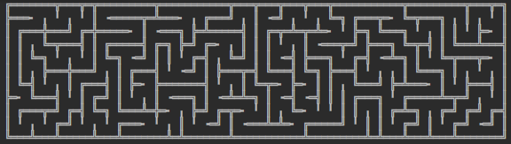
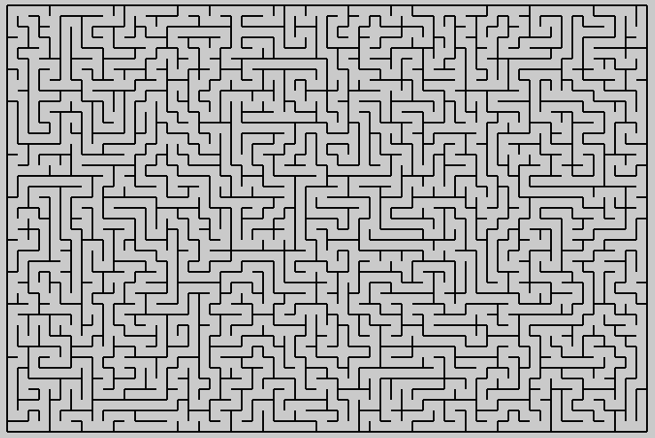
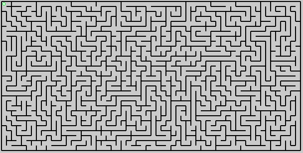
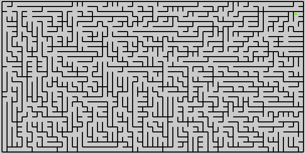
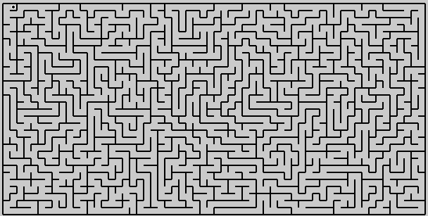

# Amaze
Simple fun learning project.

```By Ben & Tay & Cheddies```
## Requires:
Python 3  
tkinter How to install( http://www.tkdocs.com/tutorial/install.html )  
typing (pip3 install typing)

## Launching:
### For the GUI, run gui.py
```bash
python3 ./gui.py
```

### For the Text, run text.py (TODO: sizing options)

```bash
python3 ./text.py

```

This will generate mazes out of box-drawing characters,



## So far:
Currently I'm not planning on adding unit tests.  Maybe one day.

## Todo:
So, out of basic simple reasons, I chose tkinter as a gfx fe. 
There's stuff to love in tkinter for a project of this scale.



We need a mover class - with two subclasses:
√ Digger/Miner    - who constructs the maze (and leaves runes lying around)
* Adventurer      - who travels through the maze interactively.
* Robot           - who travels through the maze. automatically.

# Novelty fun: 
√ Animated miner

There are three types of miner so far.
## Miner
The 'Miner' original random walk - makes long twisty corridors, but not many decisions.


## Lister
The 'Lister' - makes many decisions, many of which are totally trivial.


## Slaver

The 'Slaver' - A hybrid, that acts like a Miner for 32/64 turns and then chooses a new spot from the
 list.
The Slaver, albeit rather nastily named, appears to produce the best mazes so far...



extra - add 'power runes':  
A rune can be used just once to open a rune-door.  
One can carry only one rune at a time.   
Running over a rune picks it up, (and drops off any currently held)  
Rune-doors: Are they opened once opened, or do they allow a single transit? 
Multiple players (sharing a keyboard of course).
Stairs that go both up and down.
Rooms.
Monsters.
Treasure.
Nethack.... ;-D

 
 
 
