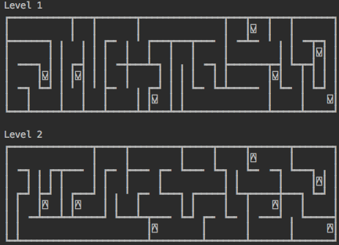

# Amaze


A Simple learning project.

```By Ben & Tay & Cheddies & Harrisson & Jake```
## Requires:
Python 3  
tkinter How to install( http://www.tkdocs.com/tutorial/install.html )  
typing (pip3 install typing)

## Launching:
### For the GUI, run gui.py
```bash
python3 ./gui.py
```

### For the Text, run text.py 
###### TODO: sizing options

```bash
python3 ./text.py
```

## √ Stairs that go both up and down.
Multi-level mazes are now mined. Currently each level is below
the previous one.. (Miner starts on the ground, and digs down)


The text application uses unicode characters for stairs.



## √ Gamer.
Bound to the keys w-a-s-d,eq,xc for north, east, west, south, ceiling, floor respectively.

## What next?

#### ? Rooms 
This should be easy enough as a digger option. Sizes and number of doors need to be worked out.

#### ? Naming
Room naming - and rune naming.  This is about adding flavour. 
Probably best to use a faker or create a faker system. It would be really
cool to have names that correspond to locations/sizes 
(small room = toilet, top level = attic etc)

#### Doors (with keys)
Add a key-maker who makes keys (and doors). An early thought was to have 
the miner be a key-maker, but it's probably best to allow for different roles to be
done by different bots.

Too much thought has gone into keys - they would be really fun.
We could have combination keys, to open combination doors.. eg a \ and a / make a V
but once you have the V you cannot walk through \ or / again.

I still think one should only be able to carry one key at a time. 
This means dropping keys that aren't being used .. but being careful..
 
## What's done?
 
√ Digger/Miner    - who constructs the maze (and leaves runes lying around)

√ Gamer           - who travels through the maze interactively.

√ Robot           - who travels through the maze. automatically.

# Novelty fun: 
√ Animated miner (gui)

There are three types of miner so far.
## Miner
The 'Miner' original random walk - makes long twisty corridors, but not many decisions.


## Lister
The 'Lister' - makes many decisions, many of which are totally trivial.


## Slaver

The 'Slaver' - A hybrid, that acts like a Miner for 32/64 turns and then chooses a new spot from the
 list. The Slaver, albeit rather nastily named, appears to produce the best mazes so far...

